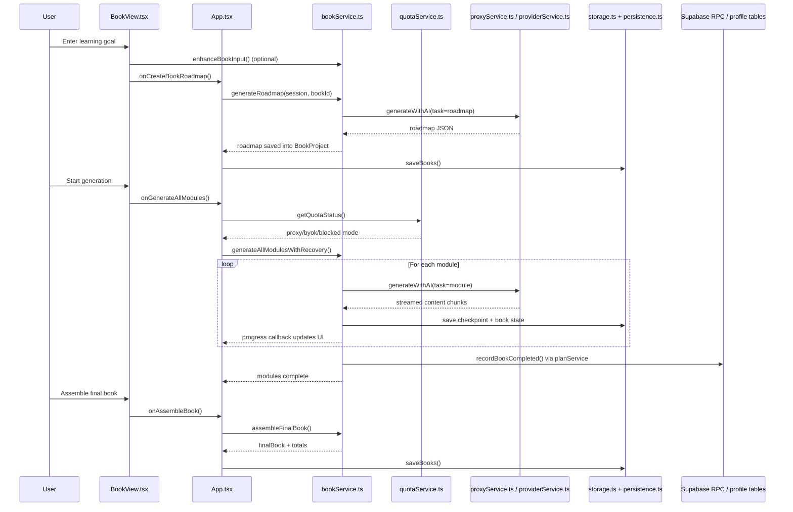
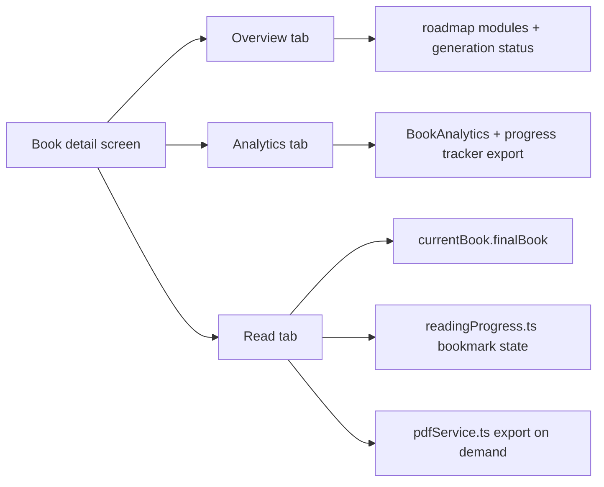

# Pustakam Architecture

This diagram reflects the current app structure in the codebase as of the latest hardening pass.

## 1. System Architecture

```mermaid
flowchart TB
    subgraph UI["Presentation Layer (React / Vite)"]
        App["App.tsx
        app shell, auth gating, quota refresh, routing"]
        Header["TopHeader.tsx
        provider/model controls, usage badge, auth menu"]
        Settings["SettingsModal.tsx
        BYOK setup, usage, data import/export"]
        Reader["BookView.tsx
        home, create, detail, read, analytics"]
        AuthUI["AuthContext.tsx + AuthModal.tsx
        session state, sign-in/out, profile refresh"]
        PWAUI["InstallPrompt.tsx + usePWA.ts
        install prompt and SW update UX"]
    end

    subgraph Domain["Application / Domain Services"]
        BookSvc["bookService.ts
        roadmap generation, module generation, retry,
        checkpoints, assembly, export hooks"]
        PlanSvc["planService.ts
        completed-book sync, profile counters"]
        QuotaSvc["quotaService.ts
        free-limit lookup, quota mode resolution, cache"]
        ProxySvc["proxyService.ts
        authenticated proxy streaming"]
        ProviderSvc["providerService.ts
        direct provider streaming + key validation"]
        Registry["providerRegistry.ts
        provider metadata, default models, endpoints"]
        Enhancements["bookEnhancements.ts
        analytics, templates, progress tracker export"]
        PdfSvc["pdfService.ts
        PDF generation"]
    end

    subgraph Persistence["Client Persistence"]
        Storage["storage.ts
        settings + books facade"]
        IDB["persistence.ts
        IndexedDB books + checkpoints"]
        Progress["readingProgress.ts
        bookmarks / reading state"]
        BYOK["byokStorage.ts
        provider key namespace per user"]
        SW["public/sw.js
        app-shell/static/image caches"]
    end

    subgraph External["External Systems"]
        Supabase["Supabase
        Auth, profiles, platform_config, RPCs"]
        Proxy["AI Proxy
        authenticated streaming endpoint"]
        Providers["Provider APIs
        Zhipu, Mistral, OpenAI, Anthropic, Google, etc."]
        Analytics["Vercel Analytics"]
    end

    App --> Header
    App --> Settings
    App --> Reader
    App --> AuthUI
    App --> PWAUI
    App --> QuotaSvc
    App --> Storage
    App --> BookSvc
    App --> PlanSvc

    Reader --> BookSvc
    Reader --> Progress
    Reader --> Enhancements
    Reader --> PdfSvc

    Settings --> Storage
    Settings --> BYOK
    Settings --> QuotaSvc
    Settings --> ProviderSvc

    BookSvc --> Registry
    BookSvc --> PlanSvc
    BookSvc --> ProxySvc
    BookSvc --> ProviderSvc
    BookSvc --> IDB

    QuotaSvc --> Supabase
    QuotaSvc --> Storage
    PlanSvc --> Supabase
    ProxySvc --> Supabase
    ProxySvc --> Proxy
    ProviderSvc --> Providers

    Storage --> IDB
    Storage --> Progress
    Storage --> BYOK
    PWAUI --> SW
    App --> Analytics
```

## 2. Book Generation Flow

## 3. Reading / Study Flow Today

## 4. Current Strengths

- Clear separation between UI shell and generation services
- Quota routing already supports proxy mode, BYOK mode, and blocked mode
- Client persistence now uses IndexedDB-first storage for heavy payloads
- Module generation is checkpointed and retry-aware
- Reading progress and PDF export are already present

## 5. Current Architectural Constraints

- `BookView.tsx` is still a very large orchestration component
- Reading is still centered on `finalBook`, not a first-class module-aware study surface
- Study features like doubts, re-explaining, flashcards, and quizzes do not yet have their own service/domain layer
- `bookService.ts` is doing a lot and should not absorb the next learning features

## 6. Recommended Next Layer

For the planned study features, add:

- `src/types/study.ts`
- `src/services/learningService.ts`
- `src/components/study/*`
- `src/utils/studyStorage.ts`

That keeps the study/tutoring layer separate from the book-generation layer.
